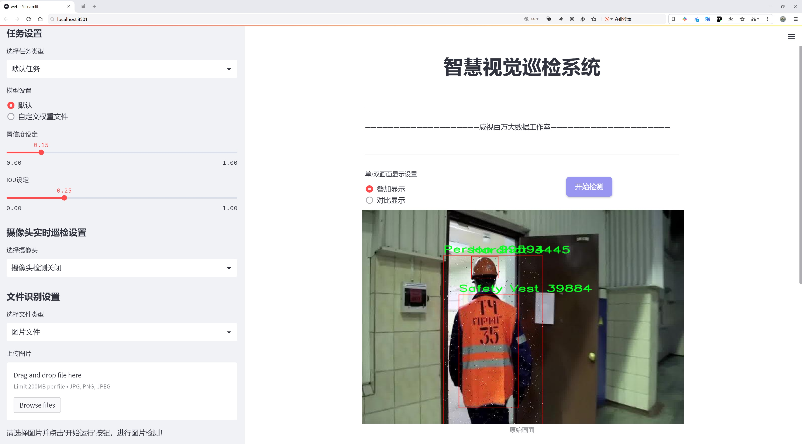
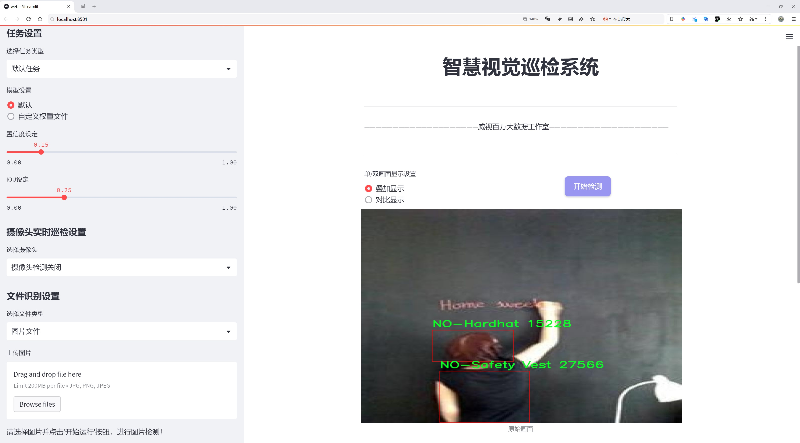
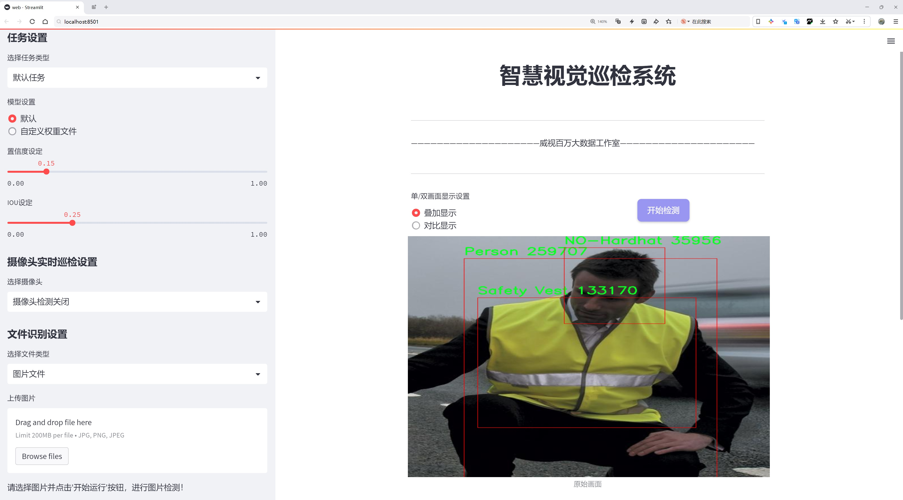
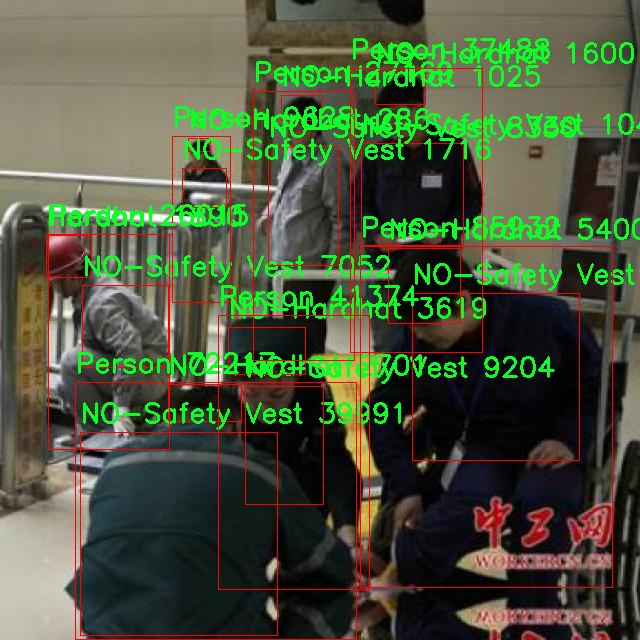
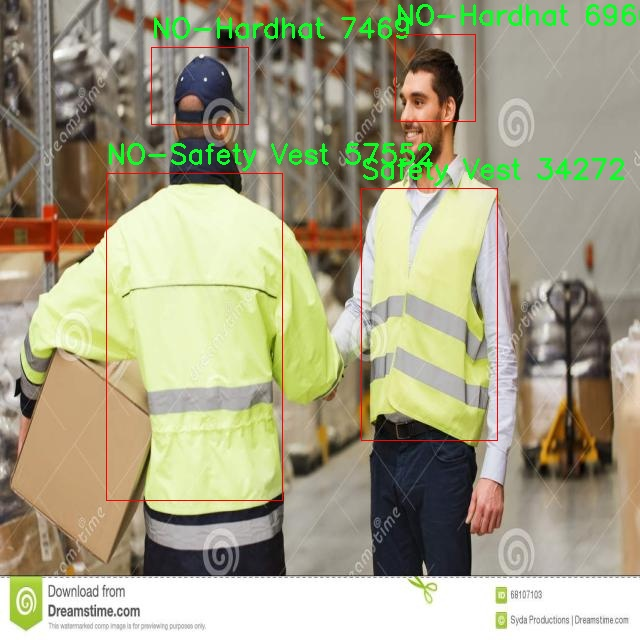

# 个人防护装备检测检测系统源码分享
 # [一条龙教学YOLOV8标注好的数据集一键训练_70+全套改进创新点发刊_Web前端展示]

### 1.研究背景与意义

项目参考[AAAI Association for the Advancement of Artificial Intelligence](https://gitee.com/qunmasj/projects)

研究背景与意义

随着工业化进程的加快，个人防护装备（PPE）在各类工作场所的安全管理中扮演着越来越重要的角色。尤其是在建筑、制造和运输等高风险行业，佩戴适当的防护装备能够有效降低工伤事故的发生率。然而，尽管许多企业已制定了严格的安全规章制度，仍然存在因员工未能正确佩戴个人防护装备而导致的安全隐患。因此，开发一种高效、准确的个人防护装备检测系统，能够实时监测和识别工作场所中员工的防护装备佩戴情况，显得尤为重要。

本研究基于改进的YOLOv8（You Only Look Once version 8）模型，旨在构建一个高效的个人防护装备检测系统。YOLOv8作为一种先进的目标检测算法，具有快速、高效的特性，能够在实时视频流中进行物体检测。通过对该模型的改进，结合特定的个人防护装备数据集，我们期望能够提高检测的准确性和鲁棒性。该数据集包含4254张图像，涵盖36个类别，包括各种防护装备（如安全帽、安全背心、手套等）以及未佩戴防护装备的状态（如无安全帽、无安全背心等）。这些丰富的类别信息为模型的训练提供了良好的基础，使其能够在多样化的工作环境中有效识别不同的防护装备状态。

在技术层面上，个人防护装备检测系统的构建不仅依赖于深度学习算法的创新，还需要大量高质量的数据支持。通过使用Roboflow平台导出的数据集，我们能够确保数据的多样性和标注的准确性。这些数据不仅涵盖了不同类型的防护装备，还包括各种工作场景下的人员图像，极大地丰富了模型的训练样本。通过对这些数据的分析和处理，我们能够进一步优化YOLOv8模型的参数设置，提高其在实际应用中的检测性能。

从社会意义上看，构建个人防护装备检测系统具有重要的现实意义。该系统的应用可以有效提升工作场所的安全管理水平，减少因未佩戴防护装备而导致的工伤事故，保护员工的生命安全和身体健康。此外，该系统还可以为企业提供实时的安全监测数据，帮助管理层及时发现和纠正安全隐患，从而推动企业安全文化的建设。

综上所述，基于改进YOLOv8的个人防护装备检测系统的研究，不仅具有重要的学术价值，也为实际应用提供了切实可行的解决方案。通过这一研究，我们希望能够为提高工作场所的安全性贡献一份力量，同时推动计算机视觉技术在安全管理领域的应用与发展。

### 2.图片演示







##### 注意：由于此博客编辑较早，上面“2.图片演示”和“3.视频演示”展示的系统图片或者视频可能为老版本，新版本在老版本的基础上升级如下：（实际效果以升级的新版本为准）

  （1）适配了YOLOV8的“目标检测”模型和“实例分割”模型，通过加载相应的权重（.pt）文件即可自适应加载模型。

  （2）支持“图片识别”、“视频识别”、“摄像头实时识别”三种识别模式。

  （3）支持“图片识别”、“视频识别”、“摄像头实时识别”三种识别结果保存导出，解决手动导出（容易卡顿出现爆内存）存在的问题，识别完自动保存结果并导出到。

  （4）支持Web前端系统中的标题、背景图等自定义修改，后面提供修改教程。

  另外本项目提供训练的数据集和训练教程,暂不提供权重文件（best.pt）,需要您按照教程进行训练后实现图片演示和Web前端界面演示的效果。

### 3.视频演示

[3.1 视频演示](https://www.bilibili.com/video/BV1i3WBepEf2/?vd_source=ff015de2d29cbe2a9cdbfa7064407a08)

### 4.数据集信息展示

数据集信息展示

本数据集名为“PPE”，旨在为改进YOLOv8的个人防护装备检测系统提供支持。该数据集包含4254张图像，涵盖36个类别，专注于各种个人防护装备及相关场景的检测。这些图像的多样性和丰富性为模型的训练提供了坚实的基础，使其能够在不同环境和条件下有效识别和分类目标对象。

在类别方面，本数据集涵盖了多种与个人防护装备相关的物品，包括但不限于挖掘机、硬帽、梯子、安全锥、安全背心等。这些类别的选择反映了在工业和建筑环境中，个人防护装备的重要性和多样性。例如，硬帽和安全背心是工人安全的基本装备，而挖掘机和其他机械设备则是这些装备使用的常见场景。通过对这些类别的详细标注，数据集能够帮助模型学习到不同装备的特征，从而提高检测的准确性和鲁棒性。

数据集中还包含了一些“无装备”类别，如“NO-Hardhat”、“NO-Safety Vest”、“no gloves”等。这些类别的设置旨在帮助模型识别缺乏必要防护装备的情况，这对于安全监测系统至关重要。通过识别这些缺失的装备，系统能够及时发出警报，从而提高工作场所的安全性。

此外，数据集中的“Person”类别也极为重要，因为它提供了与个人防护装备相关的上下文信息。通过识别图像中的人员，模型可以更好地判断这些人员是否佩戴了适当的防护装备，进而提升整体检测效果。数据集中还包括多种交通工具的类别，如SUV、巴士、厢式货车等，这些类别的存在为模型提供了更多的背景信息，有助于提高检测的准确性。

数据集的创建和标注是由Roboflow用户提供的，采用了CC BY 4.0许可证，确保了数据的开放性和可共享性。这种开放的许可方式使得研究人员和开发者能够自由使用和修改数据集，从而推动个人防护装备检测技术的发展。

最后，本数据集的导出时间为2023年10月9日，数据的时效性和相关性为模型的训练提供了最新的信息支持。通过使用这一数据集，研究人员可以更好地理解和改进YOLOv8模型在个人防护装备检测中的表现，为未来的安全监测系统提供更加精准和高效的解决方案。数据集的多样性和全面性为模型的训练提供了良好的基础，确保其在实际应用中的有效性和可靠性。







### 5.全套项目环境部署视频教程（零基础手把手教学）

[5.1 环境部署教程链接（零基础手把手教学）](https://www.ixigua.com/7404473917358506534?logTag=c807d0cbc21c0ef59de5)


[5.2 安装Python虚拟环境创建和依赖库安装视频教程链接（零基础手把手教学）](https://www.ixigua.com/7404474678003106304?logTag=1f1041108cd1f708b01a)

### 6.手把手YOLOV8训练视频教程（零基础小白有手就能学会）

[6.1 环境部署教程链接（零基础手把手教学）](https://www.ixigua.com/7404477157818401292?logTag=d31a2dfd1983c9668658)

### 7.70+种全套YOLOV8创新点代码加载调参视频教程（一键加载写好的改进模型的配置文件）

[7.1 环境部署教程链接（零基础手把手教学）](https://www.ixigua.com/7404478314661806627?logTag=29066f8288e3f4eea3a4)

### 8.70+种全套YOLOV8创新点原理讲解（非科班也可以轻松写刊发刊，V10版本正在科研待更新）

由于篇幅限制，每个创新点的具体原理讲解就不一一展开，具体见下列网址中的创新点对应子项目的技术原理博客网址【Blog】：


[8.1 70+种全套YOLOV8创新点原理讲解链接](https://gitee.com/qunmasj/good)

### 9.系统功能展示（检测对象为举例，实际内容以本项目数据集为准）

图1.系统支持检测结果表格显示

  图2.系统支持置信度和IOU阈值手动调节

  图3.系统支持自定义加载权重文件best.pt(需要你通过步骤5中训练获得)

  图4.系统支持摄像头实时识别

  图5.系统支持图片识别

  图6.系统支持视频识别

  图7.系统支持识别结果文件自动保存

  图8.系统支持Excel导出检测结果数据


### 10.原始YOLOV8算法原理

原始YOLOv8算法原理

YOLOv8算法是由Glenn-Jocher提出的最新一代YOLO系列目标检测模型，它在YOLOv3和YOLOv5的基础上进行了多项重要改进，旨在提高目标检测的速度和精度。自2015年YOLO模型首次推出以来，YOLO系列已经历了多个版本的迭代，而YOLOv8作为第八个版本，凭借其卓越的性能和灵活的应用，迅速成为业界的热门选择。

YOLOv8的网络结构主要由三部分组成：Backbone（骨干网络）、Neck（颈部结构）和Head（头部结构）。其中，Backbone负责特征提取，Neck则用于特征融合，而Head则通过解耦头结构输出检测信息。这种分层设计使得YOLOv8能够有效地捕捉和处理多尺度特征，从而提升目标检测的准确性。

在数据预处理方面，YOLOv8延续了YOLOv5的策略，采用了多种增强手段，包括马赛克增强、混合增强、空间扰动和颜色扰动等。这些数据增强技术不仅丰富了训练数据集，还有效提高了模型的鲁棒性，使其在面对复杂场景时能够保持良好的检测性能。

YOLOv8的骨干网络结构也进行了重要的改进。虽然其基本架构仍然受到YOLOv5的启发，但YOLOv8引入了C2f模块，替代了YOLOv5中的C3模块。C2f模块通过增加更多的分支，丰富了梯度回传时的支流，增强了特征提取的能力。这种设计使得YOLOv8在处理高维特征时更加高效，能够更好地捕捉到图像中的细节信息。

在特征融合方面，YOLOv8继续采用FPN（Feature Pyramid Network）和PAN（Path Aggregation Network）结构，以实现多尺度信息的充分融合。FPN-PAN结构通过将不同层次的特征进行组合，确保了模型在处理各种尺度的目标时都能保持高效的检测能力。尽管YOLOv8对FPN-PAN结构进行了优化，替换了C3模块为C2f模块，但整体结构与YOLOv5保持一致，确保了其在多尺度目标检测中的优势。

YOLOv8在检测头的设计上也进行了显著的创新。与YOLOv3和YOLOv5的耦合检测头不同，YOLOv8采用了解耦头结构。这种结构将分类和定位任务分为两个并行的分支，各自使用一层1×1卷积进行处理。这种解耦设计不仅提高了模型的灵活性，还使得分类和定位任务可以独立优化，从而进一步提升了检测精度。

在标签分配策略方面，YOLOv8引入了TOOD（Target-Oriented Object Detection）策略，取代了YOLOv5的候选框聚类方法。TOOD策略通过动态标签分配，有效解决了正负样本匹配的问题。与YOLOX的SimOTA不同，YOLOv8的标签分配仅依赖于目标框和目标分数，简化了模型的训练过程。YOLOv8的损失函数主要包括类别损失和位置损失，其中类别损失采用了变焦损失（Varifocal Loss），而回归损失则结合了CIoU（Complete Intersection over Union）损失和DFL（Discriminative Focal Loss）损失。这种损失函数设计旨在提高模型对高质量正样本的关注，同时降低负样本对整体损失的影响，从而实现更为精准的目标检测。

YOLOv8的多样化模型设置使其在不同应用场景中表现出色。通过调整depth_factor、width_factor和ratio等参数，用户可以根据具体需求灵活配置模型的深度和宽度，以适应不同的硬件环境和应用场景。这种灵活性不仅提高了模型的可用性，也为研究人员和开发者提供了更多的实验空间。

总的来说，YOLOv8作为YOLO系列的最新版本，凭借其高效的特征提取、灵活的特征融合和精确的目标检测能力，成为了当前目标检测领域的佼佼者。其在数据预处理、网络结构、标签分配等方面的创新，使得YOLOv8在实际应用中展现出更强的适应性和更高的性能。随着YOLOv8的不断发展和完善，未来在智能监控、自动驾驶、医疗影像等领域的应用前景将更加广阔。


### 11.项目核心源码讲解（再也不用担心看不懂代码逻辑）

#### 11.1 ultralytics\utils\files.py

以下是经过简化和注释的核心代码部分：

```python
import os
import shutil
import tempfile
from contextlib import contextmanager
from pathlib import Path

@contextmanager
def spaces_in_path(path):
    """
    处理路径中包含空格的上下文管理器。
    如果路径中包含空格，则将其替换为下划线，复制文件/目录到新路径，
    执行上下文代码块，然后将文件/目录复制回原位置。

    参数:
        path (str | Path): 原始路径。

    返回:
        (Path): 替换空格后的临时路径，如果没有空格，则返回原始路径。
    """
    if " " in str(path):
        path = Path(path)  # 转换为Path对象
        with tempfile.TemporaryDirectory() as tmp_dir:  # 创建临时目录
            tmp_path = Path(tmp_dir) / path.name.replace(" ", "_")  # 替换空格后的新路径

            # 复制文件或目录
            if path.is_dir():
                shutil.copytree(path, tmp_path)  # 复制目录
            elif path.is_file():
                shutil.copy2(path, tmp_path)  # 复制文件

            try:
                yield tmp_path  # 返回临时路径
            finally:
                # 将文件/目录复制回原位置
                if tmp_path.is_dir():
                    shutil.copytree(tmp_path, path, dirs_exist_ok=True)
                elif tmp_path.is_file():
                    shutil.copy2(tmp_path, path)  # 复制回文件
    else:
        yield path  # 如果没有空格，直接返回原始路径

def increment_path(path, exist_ok=False, sep="", mkdir=False):
    """
    增加文件或目录路径，例如：runs/exp --> runs/exp{sep}2, runs/exp{sep}3, ...等。

    参数:
        path (str, pathlib.Path): 要增加的路径。
        exist_ok (bool, optional): 如果为True，路径将不会增加，直接返回。默认为False。
        sep (str, optional): 路径和增加数字之间的分隔符。默认为''。
        mkdir (bool, optional): 如果路径不存在，则创建目录。默认为False。

    返回:
        (pathlib.Path): 增加后的路径。
    """
    path = Path(path)  # 转换为Path对象
    if path.exists() and not exist_ok:
        path, suffix = (path.with_suffix(""), path.suffix) if path.is_file() else (path, "")

        # 增加路径
        for n in range(2, 9999):
            p = f"{path}{sep}{n}{suffix}"  # 生成新的路径
            if not os.path.exists(p):
                break
        path = Path(p)

    if mkdir:
        path.mkdir(parents=True, exist_ok=True)  # 创建目录

    return path

def file_size(path):
    """返回文件或目录的大小（MB）。"""
    if isinstance(path, (str, Path)):
        mb = 1 << 20  # 将字节转换为MB
        path = Path(path)
        if path.is_file():
            return path.stat().st_size / mb  # 返回文件大小
        elif path.is_dir():
            return sum(f.stat().st_size for f in path.glob("**/*") if f.is_file()) / mb  # 返回目录大小
    return 0.0

def get_latest_run(search_dir="."):
    """返回最近的 'last.pt' 文件路径，用于恢复训练。"""
    last_list = glob.glob(f"{search_dir}/**/last*.pt", recursive=True)  # 查找所有last*.pt文件
    return max(last_list, key=os.path.getctime) if last_list else ""  # 返回最新的文件路径
```

### 代码核心部分分析
1. **`spaces_in_path`**: 处理路径中包含空格的情况，确保在执行代码时不会因为路径中的空格而导致错误。通过创建临时路径来避免问题。

2. **`increment_path`**: 用于生成一个新的文件或目录路径，确保路径唯一性，适用于需要多次保存的场景（如实验结果）。

3. **`file_size`**: 计算文件或目录的大小，方便用户了解文件占用的存储空间。

4. **`get_latest_run`**: 查找最近的训练结果文件，便于用户恢复训练。

这个文件是一个名为 `files.py` 的 Python 模块，属于 Ultralytics YOLO 项目，主要用于处理文件和目录的操作。它包含了一些实用的功能，比如更改工作目录、处理路径中的空格、递增路径、获取文件的修改时间和大小等。

首先，文件中定义了一个 `WorkingDirectory` 类，它是一个上下文管理器，允许用户在指定的目录中执行代码。通过使用 `with` 语句或装饰器的方式，可以在进入上下文时切换到新的工作目录，并在退出时恢复到原来的工作目录。这对于需要在特定目录下执行一系列操作的场景非常有用。

接下来，定义了一个 `spaces_in_path` 的上下文管理器，用于处理路径中包含空格的情况。如果路径中有空格，它会将空格替换为下划线，并将文件或目录复制到一个临时位置，执行上下文中的代码，最后再将文件或目录复制回原来的位置。这可以避免因为路径中有空格而导致的一些潜在问题。

`increment_path` 函数用于递增文件或目录的路径。如果指定的路径已经存在，且 `exist_ok` 参数为 `False`，它会在路径后面添加一个数字后缀以避免冲突。该函数还支持创建目录的功能，如果 `mkdir` 参数为 `True`，则会在路径不存在时创建该目录。

`file_age` 函数返回自文件上次更新以来的天数，通过计算当前时间与文件最后修改时间的差值来实现。`file_date` 函数则返回文件的最后修改日期，格式为“年-月-日”。

`file_size` 函数用于返回文件或目录的大小（以MB为单位）。如果传入的是文件路径，它会返回该文件的大小；如果是目录路径，则会计算该目录下所有文件的总大小。

最后，`get_latest_run` 函数用于查找指定目录下最新的 `last.pt` 文件，通常用于恢复训练。它会在指定的搜索目录中递归查找符合条件的文件，并返回最新文件的路径。

整体来看，这个模块提供了一系列实用的文件和目录操作功能，能够帮助用户在进行文件处理时更加高效和便捷。

#### 11.2 ultralytics\trackers\utils\matching.py

以下是代码中最核心的部分，并附上详细的中文注释：

```python
import numpy as np
import scipy
from scipy.spatial.distance import cdist
from ultralytics.utils.metrics import bbox_ioa

# 尝试导入 lap 库用于线性分配
try:
    import lap  # for linear_assignment
    assert lap.__version__  # 验证包不是目录
except (ImportError, AssertionError, AttributeError):
    from ultralytics.utils.checks import check_requirements
    check_requirements("lapx>=0.5.2")  # 更新到 lap 包
    import lap

def linear_assignment(cost_matrix: np.ndarray, thresh: float, use_lap: bool = True) -> tuple:
    """
    使用 scipy 或 lap.lapjv 进行线性分配。

    参数:
        cost_matrix (np.ndarray): 包含分配成本值的矩阵。
        thresh (float): 认为分配有效的阈值。
        use_lap (bool, optional): 是否使用 lap.lapjv。默认为 True。

    返回:
        包含以下内容的元组：
            - 匹配的索引
            - 'a' 中未匹配的索引
            - 'b' 中未匹配的索引
    """
    # 如果成本矩阵为空，返回空匹配和所有未匹配的索引
    if cost_matrix.size == 0:
        return np.empty((0, 2), dtype=int), tuple(range(cost_matrix.shape[0])), tuple(range(cost_matrix.shape[1]))

    if use_lap:
        # 使用 lap.lapjv 进行线性分配
        _, x, y = lap.lapjv(cost_matrix, extend_cost=True, cost_limit=thresh)
        matches = [[ix, mx] for ix, mx in enumerate(x) if mx >= 0]  # 找到匹配的索引
        unmatched_a = np.where(x < 0)[0]  # 找到未匹配的 'a' 索引
        unmatched_b = np.where(y < 0)[0]  # 找到未匹配的 'b' 索引
    else:
        # 使用 scipy.optimize.linear_sum_assignment 进行线性分配
        x, y = scipy.optimize.linear_sum_assignment(cost_matrix)  # 行 x，列 y
        matches = np.asarray([[x[i], y[i]] for i in range(len(x)) if cost_matrix[x[i], y[i]] <= thresh])
        if len(matches) == 0:
            unmatched_a = list(np.arange(cost_matrix.shape[0]))
            unmatched_b = list(np.arange(cost_matrix.shape[1]))
        else:
            unmatched_a = list(set(np.arange(cost_matrix.shape[0])) - set(matches[:, 0]))
            unmatched_b = list(set(np.arange(cost_matrix.shape[1])) - set(matches[:, 1]))

    return matches, unmatched_a, unmatched_b  # 返回匹配和未匹配的索引

def iou_distance(atracks: list, btracks: list) -> np.ndarray:
    """
    基于交并比 (IoU) 计算轨迹之间的成本。

    参数:
        atracks (list[STrack] | list[np.ndarray]): 轨迹 'a' 或边界框的列表。
        btracks (list[STrack] | list[np.ndarray]): 轨迹 'b' 或边界框的列表。

    返回:
        (np.ndarray): 基于 IoU 计算的成本矩阵。
    """
    # 确定输入轨迹的边界框
    if atracks and isinstance(atracks[0], np.ndarray) or btracks and isinstance(btracks[0], np.ndarray):
        atlbrs = atracks
        btlbrs = btracks
    else:
        atlbrs = [track.tlbr for track in atracks]  # 获取轨迹 'a' 的边界框
        btlbrs = [track.tlbr for track in btracks]  # 获取轨迹 'b' 的边界框

    ious = np.zeros((len(atlbrs), len(btlbrs)), dtype=np.float32)  # 初始化 IoU 矩阵
    if len(atlbrs) and len(btlbrs):
        # 计算 IoU
        ious = bbox_ioa(
            np.ascontiguousarray(atlbrs, dtype=np.float32), np.ascontiguousarray(btlbrs, dtype=np.float32), iou=True
        )
    return 1 - ious  # 返回成本矩阵

def embedding_distance(tracks: list, detections: list, metric: str = "cosine") -> np.ndarray:
    """
    基于嵌入计算轨迹和检测之间的距离。

    参数:
        tracks (list[STrack]): 轨迹列表。
        detections (list[BaseTrack]): 检测列表。
        metric (str, optional): 距离计算的度量。默认为 'cosine'。

    返回:
        (np.ndarray): 基于嵌入计算的成本矩阵。
    """
    cost_matrix = np.zeros((len(tracks), len(detections)), dtype=np.float32)  # 初始化成本矩阵
    if cost_matrix.size == 0:
        return cost_matrix
    det_features = np.asarray([track.curr_feat for track in detections], dtype=np.float32)  # 获取检测特征
    track_features = np.asarray([track.smooth_feat for track in tracks], dtype=np.float32)  # 获取轨迹特征
    cost_matrix = np.maximum(0.0, cdist(track_features, det_features, metric))  # 计算距离
    return cost_matrix  # 返回成本矩阵

def fuse_score(cost_matrix: np.ndarray, detections: list) -> np.ndarray:
    """
    将成本矩阵与检测分数融合以生成单一相似度矩阵。

    参数:
        cost_matrix (np.ndarray): 包含分配成本值的矩阵。
        detections (list[BaseTrack]): 带有分数的检测列表。

    返回:
        (np.ndarray): 融合后的相似度矩阵。
    """
    if cost_matrix.size == 0:
        return cost_matrix
    iou_sim = 1 - cost_matrix  # 计算 IoU 相似度
    det_scores = np.array([det.score for det in detections])  # 获取检测分数
    det_scores = np.expand_dims(det_scores, axis=0).repeat(cost_matrix.shape[0], axis=0)  # 扩展分数维度
    fuse_sim = iou_sim * det_scores  # 融合相似度
    return 1 - fuse_sim  # 返回融合后的成本
```

### 代码核心部分说明：
1. **线性分配**：`linear_assignment` 函数用于根据成本矩阵进行线性分配，返回匹配和未匹配的索引。
2. **IoU 计算**：`iou_distance` 函数计算两个轨迹之间的交并比，返回成本矩阵。
3. **嵌入距离计算**：`embedding_distance` 函数计算轨迹和检测之间的距离，返回成本矩阵。
4. **分数融合**：`fuse_score` 函数将成本矩阵与检测分数融合，生成相似度矩阵。

这个程序文件 `ultralytics/trackers/utils/matching.py` 主要用于处理目标跟踪中的匹配问题，特别是通过计算代价矩阵来进行目标跟踪的分配和匹配。文件中使用了 NumPy 和 SciPy 库来进行数值计算，并且引入了一个名为 `lap` 的库来执行线性分配。

首先，文件中定义了一个 `linear_assignment` 函数，该函数接收一个代价矩阵和一个阈值，返回匹配的索引以及未匹配的索引。函数首先检查代价矩阵是否为空，如果为空，则返回空的匹配结果和所有未匹配的索引。如果选择使用 `lap` 库，则调用 `lap.lapjv` 方法进行线性分配；否则，使用 SciPy 的 `linear_sum_assignment` 方法。最终，函数返回匹配的结果和未匹配的索引。

接下来，文件定义了 `iou_distance` 函数，该函数用于计算基于交并比（IoU）的代价矩阵。它接收两个轨迹列表，判断输入类型并提取边界框的坐标，然后计算这些边界框之间的 IoU 值，并返回 1 减去 IoU 值作为代价矩阵。

然后是 `embedding_distance` 函数，它计算轨迹和检测之间的距离，基于特征嵌入。该函数首先初始化一个代价矩阵，然后提取检测的特征，使用 `scipy.spatial.distance.cdist` 方法计算轨迹特征与检测特征之间的距离，并返回代价矩阵。

最后，文件中定义了 `fuse_score` 函数，它将代价矩阵与检测得分融合，生成一个单一的相似度矩阵。该函数计算 IoU 相似度，并将检测得分扩展到与代价矩阵相同的形状，最终返回融合后的相似度矩阵。

整体而言，这个文件实现了目标跟踪中常用的匹配算法，通过计算不同的代价矩阵（如 IoU 和特征嵌入距离）来帮助在不同的检测和跟踪之间进行有效的匹配。

#### 11.3 ui.py

```python
import sys
import subprocess

def run_script(script_path):
    """
    使用当前 Python 环境运行指定的脚本。

    Args:
        script_path (str): 要运行的脚本路径

    Returns:
        None
    """
    # 获取当前 Python 解释器的路径
    python_path = sys.executable

    # 构建运行命令，使用 streamlit 运行指定的脚本
    command = f'"{python_path}" -m streamlit run "{script_path}"'

    # 执行命令并等待其完成
    result = subprocess.run(command, shell=True)
    
    # 检查命令执行的返回码，如果不为0则表示出错
    if result.returncode != 0:
        print("脚本运行出错。")


# 实例化并运行应用
if __name__ == "__main__":
    # 指定要运行的脚本路径
    script_path = "web.py"  # 假设脚本在当前目录下

    # 调用函数运行脚本
    run_script(script_path)
```

### 代码注释说明：
1. **导入模块**：
   - `sys`：用于获取当前 Python 解释器的路径。
   - `subprocess`：用于执行外部命令。

2. **定义 `run_script` 函数**：
   - 该函数接收一个参数 `script_path`，表示要运行的 Python 脚本的路径。
   - 使用 `sys.executable` 获取当前 Python 解释器的路径，以便在正确的环境中运行脚本。
   - 构建命令字符串，使用 `streamlit` 模块运行指定的脚本。
   - 使用 `subprocess.run` 执行构建的命令，并等待其完成。
   - 检查命令的返回码，如果返回码不为0，表示脚本运行出错，打印错误信息。

3. **主程序入口**：
   - 使用 `if __name__ == "__main__":` 确保该部分代码仅在直接运行脚本时执行。
   - 指定要运行的脚本路径（在此示例中为 `web.py`）。
   - 调用 `run_script` 函数来执行指定的脚本。

这个程序文件名为 `ui.py`，其主要功能是通过当前的 Python 环境运行一个指定的脚本。代码中首先导入了必要的模块，包括 `sys`、`os` 和 `subprocess`，以及一个自定义的路径处理模块 `abs_path`。

在 `run_script` 函数中，首先获取当前 Python 解释器的路径，使用 `sys.executable` 来实现。接着，构建一个命令字符串，该命令使用 `streamlit` 来运行指定的脚本。这里的 `script_path` 参数是传入的脚本路径，格式化后的命令字符串将会被传递给 `subprocess.run` 方法。

`subprocess.run` 用于在新的进程中执行命令。通过设置 `shell=True`，可以在 shell 中执行命令。函数会检查命令的返回码，如果返回码不为 0，表示脚本运行出错，此时会打印出错误信息。

在文件的最后部分，使用 `if __name__ == "__main__":` 来确保只有在直接运行该文件时才会执行以下代码。这里指定了要运行的脚本路径为 `web.py`，并调用 `run_script` 函数来执行这个脚本。

总体来说，这个程序的主要作用是封装了一个简单的接口，用于在当前 Python 环境中运行指定的 Streamlit 脚本，并处理可能出现的错误。

#### 11.4 ultralytics\models\rtdetr\predict.py

以下是代码中最核心的部分，并附上详细的中文注释：

```python
import torch
from ultralytics.data.augment import LetterBox
from ultralytics.engine.predictor import BasePredictor
from ultralytics.engine.results import Results
from ultralytics.utils import ops

class RTDETRPredictor(BasePredictor):
    """
    RT-DETR (Real-Time Detection Transformer) 预测器，扩展自 BasePredictor 类，用于使用百度的 RT-DETR 模型进行预测。

    该类利用视觉变换器的强大功能，提供实时物体检测，同时保持高精度。支持高效的混合编码和 IoU 感知查询选择等关键特性。
    """

    def postprocess(self, preds, img, orig_imgs):
        """
        对模型的原始预测结果进行后处理，以生成边界框和置信度分数。

        该方法根据置信度和类别过滤检测结果（如果在 `self.args` 中指定）。

        参数:
            preds (torch.Tensor): 模型的原始预测结果。
            img (torch.Tensor): 处理后的输入图像。
            orig_imgs (list or torch.Tensor): 原始未处理的图像。

        返回:
            (list[Results]): 包含后处理后的边界框、置信度分数和类别标签的 Results 对象列表。
        """
        # 获取预测结果的维度
        nd = preds[0].shape[-1]
        # 分割边界框和分数
        bboxes, scores = preds[0].split((4, nd - 4), dim=-1)

        # 如果输入图像不是列表，则转换为 numpy 格式
        if not isinstance(orig_imgs, list):
            orig_imgs = ops.convert_torch2numpy_batch(orig_imgs)

        results = []
        for i, bbox in enumerate(bboxes):  # 遍历每个边界框
            # 将边界框从 xywh 格式转换为 xyxy 格式
            bbox = ops.xywh2xyxy(bbox)
            # 获取每个边界框的最大分数和对应的类别
            score, cls = scores[i].max(-1, keepdim=True)
            # 根据置信度过滤
            idx = score.squeeze(-1) > self.args.conf
            # 如果指定了类别，则进一步过滤
            if self.args.classes is not None:
                idx = (cls == torch.tensor(self.args.classes, device=cls.device)).any(1) & idx
            # 过滤后的预测结果
            pred = torch.cat([bbox, score, cls], dim=-1)[idx]
            orig_img = orig_imgs[i]
            oh, ow = orig_img.shape[:2]  # 获取原始图像的高度和宽度
            # 将预测的边界框坐标缩放到原始图像尺寸
            pred[..., [0, 2]] *= ow
            pred[..., [1, 3]] *= oh
            img_path = self.batch[0][i]  # 获取图像路径
            # 将结果添加到列表中
            results.append(Results(orig_img, path=img_path, names=self.model.names, boxes=pred))
        return results

    def pre_transform(self, im):
        """
        在将输入图像输入模型进行推理之前，对其进行预处理。输入图像被调整为方形比例并填充。

        参数:
            im (list[np.ndarray] | torch.Tensor): 输入图像，形状为 (N,3,h,w) 的张量，或 [(h,w,3) x N] 的列表。

        返回:
            (list): 预处理后的图像列表，准备进行模型推理。
        """
        # 创建 LetterBox 对象以进行图像调整
        letterbox = LetterBox(self.imgsz, auto=False, scaleFill=True)
        # 对每个图像进行调整并返回
        return [letterbox(image=x) for x in im]
```

### 代码核心部分说明：
1. **RTDETRPredictor 类**：该类是 RT-DETR 模型的预测器，负责处理输入图像并生成预测结果。
2. **postprocess 方法**：该方法对模型的原始预测结果进行后处理，提取边界框、置信度和类别，并根据置信度和类别进行过滤。
3. **pre_transform 方法**：该方法对输入图像进行预处理，以确保它们符合模型的输入要求（如方形尺寸和填充）。

这个程序文件是用于实现RT-DETR（实时检测变换器）模型的预测功能，继承自基础预测器类`BasePredictor`。RT-DETR模型结合了视觉变换器的优势，能够在保持高准确度的同时实现实时目标检测。该类支持高效的混合编码和IoU（交并比）感知查询选择等关键特性。

在文件中，首先导入了必要的库和模块，包括PyTorch和一些来自Ultralytics的工具。接着定义了`RTDETRPredictor`类，该类包含了一些重要的属性和方法。

类的构造函数中定义了两个主要属性：`imgsz`，表示推理时使用的图像大小（必须是正方形并且填充比例合适）；`args`，用于存储传递给预测器的参数覆盖选项。

`postprocess`方法用于对模型的原始预测结果进行后处理，以生成边界框和置信度分数。该方法首先将预测结果分为边界框和分数，并根据置信度和类别进行过滤。处理过程中，如果输入图像不是列表格式，则将其转换为NumPy数组。然后，方法会遍历每个边界框，转换坐标格式，并根据置信度和类别进行筛选，最终生成一个包含后处理结果的`Results`对象列表。

`pre_transform`方法则负责在将输入图像送入模型进行推理之前进行预处理。它使用`LetterBox`类将输入图像调整为正方形的尺寸，以确保适合模型的输入要求。该方法支持输入为PyTorch张量或列表格式的图像，并返回经过预处理的图像列表，准备好进行模型推理。

整体而言，这个文件实现了RT-DETR模型的预测功能，包括图像的预处理和后处理，确保模型能够高效且准确地进行目标检测。

#### 11.5 ultralytics\models\rtdetr\model.py

```python
# Ultralytics YOLO 🚀, AGPL-3.0 license
"""
RT-DETR接口，基于视觉变换器的实时目标检测器。RT-DETR提供实时性能和高准确性，
在CUDA和TensorRT等加速后端中表现出色。它具有高效的混合编码器和IoU感知查询选择，
以提高检测准确性。
"""

from ultralytics.engine.model import Model  # 导入基础模型类
from ultralytics.nn.tasks import RTDETRDetectionModel  # 导入RT-DETR检测模型

from .predict import RTDETRPredictor  # 导入预测器
from .train import RTDETRTrainer  # 导入训练器
from .val import RTDETRValidator  # 导入验证器


class RTDETR(Model):
    """
    RT-DETR模型接口。该基于视觉变换器的目标检测器提供实时性能和高准确性。
    支持高效的混合编码、IoU感知查询选择和可调的推理速度。

    属性:
        model (str): 预训练模型的路径，默认为'rtdetr-l.pt'。
    """

    def __init__(self, model="rtdetr-l.pt") -> None:
        """
        使用给定的预训练模型文件初始化RT-DETR模型。支持.pt和.yaml格式。

        参数:
            model (str): 预训练模型的路径，默认为'rtdetr-l.pt'。

        异常:
            NotImplementedError: 如果模型文件扩展名不是'pt'、'yaml'或'yml'。
        """
        # 检查模型文件扩展名是否有效
        if model and model.split(".")[-1] not in ("pt", "yaml", "yml"):
            raise NotImplementedError("RT-DETR只支持从*.pt、*.yaml或*.yml文件创建。")
        super().__init__(model=model, task="detect")  # 调用父类构造函数

    @property
    def task_map(self) -> dict:
        """
        返回RT-DETR的任务映射，将任务与相应的Ultralytics类关联。

        返回:
            dict: 一个字典，将任务名称映射到RT-DETR模型的Ultralytics任务类。
        """
        return {
            "detect": {
                "predictor": RTDETRPredictor,  # 预测器类
                "validator": RTDETRValidator,  # 验证器类
                "trainer": RTDETRTrainer,  # 训练器类
                "model": RTDETRDetectionModel,  # RT-DETR检测模型类
            }
        }
```

### 代码核心部分及注释说明：

1. **导入模块**：
   - 导入必要的类和模块，以便在RT-DETR模型中使用。

2. **RTDETR类**：
   - 该类继承自`Model`，是RT-DETR模型的接口，负责初始化和管理模型的任务。

3. **初始化方法**：
   - `__init__`方法用于初始化RT-DETR模型，接受一个模型路径参数，检查文件扩展名是否有效。

4. **任务映射属性**：
   - `task_map`属性返回一个字典，映射检测任务到相应的预测器、验证器、训练器和模型类，以便于任务的管理和调用。

这个程序文件是关于百度的RT-DETR模型的接口实现，RT-DETR是一种基于视觉变换器（Vision Transformer）的实时目标检测器，具有高效的实时性能和高准确性，特别适合在CUDA和TensorRT等加速后端上运行。文件中包含了模型的基本结构和功能。

首先，文件引入了几个必要的模块，包括Ultralytics的基础模型类、RT-DETR的检测模型、预测器、训练器和验证器。这些模块为RT-DETR模型的功能提供了支持。

RTDETR类继承自Ultralytics的Model类，构造函数接受一个参数model，表示预训练模型的路径，默认值为'rtdetr-l.pt'。在初始化过程中，程序会检查模型文件的扩展名，确保它是支持的格式（.pt、.yaml或.yml），如果不是，则会抛出NotImplementedError异常。

RTDETR类还定义了一个名为task_map的属性，它返回一个字典，映射了与RT-DETR相关的任务和相应的Ultralytics类。这个字典包括了预测器、验证器、训练器和检测模型的类，便于在不同的任务中使用RT-DETR模型。

总的来说，这个文件为RT-DETR模型提供了一个清晰的接口，方便用户进行目标检测任务的实现和管理。通过使用这个接口，用户可以轻松地加载预训练模型，并进行预测、训练和验证等操作。

#### 11.6 ultralytics\utils\benchmarks.py

以下是代码中最核心的部分，并附上详细的中文注释：

```python
import time
import numpy as np
import pandas as pd
from ultralytics import YOLO
from ultralytics.utils import select_device, check_requirements, check_yolo, file_size

def benchmark(
    model='yolov8n.pt', data=None, imgsz=160, half=False, int8=False, device="cpu", verbose=False
):
    """
    基准测试YOLO模型在不同格式下的速度和准确性。

    参数:
        model (str | Path | optional): 模型文件或目录的路径，默认为'yolov8n.pt'。
        data (str, optional): 用于评估的数据集，默认为None。
        imgsz (int, optional): 基准测试的图像大小，默认为160。
        half (bool, optional): 如果为True，则使用半精度模型，默认为False。
        int8 (bool, optional): 如果为True，则使用int8精度模型，默认为False。
        device (str, optional): 基准测试运行的设备，可以是'cpu'或'cuda'，默认为'cpu'。
        verbose (bool | float | optional): 如果为True或浮点数，则在给定指标下断言基准测试通过，默认为False。

    返回:
        df (pandas.DataFrame): 包含每种格式的基准测试结果的DataFrame，包括文件大小、指标和推理时间。
    """
    
    pd.options.display.max_columns = 10  # 设置pandas显示的最大列数
    pd.options.display.width = 120  # 设置pandas显示的宽度
    device = select_device(device, verbose=False)  # 选择设备（CPU或GPU）
    
    model = YOLO(model)  # 加载YOLO模型

    results = []  # 存储结果的列表
    start_time = time.time()  # 记录开始时间

    # 遍历导出格式
    for i, (name, format, suffix, cpu, gpu) in export_formats().iterrows():
        emoji, filename = "❌", None  # 默认导出状态为失败
        try:
            # 检查导出格式的兼容性
            if i in {5, 10}:  # CoreML和TF.js格式
                assert MACOS or LINUX, "export only supported on macOS and Linux"
            if "cpu" in device.type:
                assert cpu, "inference not supported on CPU"
            if "cuda" in device.type:
                assert gpu, "inference not supported on GPU"

            # 导出模型
            if format == "-":
                filename = model.ckpt_path or model.cfg  # PyTorch格式
                exported_model = model  # 使用原始模型
            else:
                filename = model.export(imgsz=imgsz, format=format, half=half, int8=int8, device=device, verbose=False)
                exported_model = YOLO(filename, task=model.task)  # 加载导出的模型
                assert suffix in str(filename), "export failed"  # 检查导出是否成功
            emoji = "❎"  # 导出成功

            # 进行推理
            exported_model.predict(ASSETS / "bus.jpg", imgsz=imgsz, device=device, half=half)

            # 验证模型
            data = data or TASK2DATA[model.task]  # 获取数据集
            key = TASK2METRIC[model.task]  # 获取指标
            results = exported_model.val(
                data=data, batch=1, imgsz=imgsz, plots=False, device=device, half=half, int8=int8, verbose=False
            )
            metric, speed = results.results_dict[key], results.speed["inference"]  # 获取指标和速度
            results.append([name, "✅", round(file_size(filename), 1), round(metric, 4), round(speed, 2)])  # 记录结果
        except Exception as e:
            LOGGER.warning(f"ERROR ❌️ Benchmark failure for {name}: {e}")  # 记录错误
            results.append([name, emoji, round(file_size(filename), 1), None, None])  # 记录失败结果

    # 打印结果
    check_yolo(device=device)  # 打印系统信息
    df = pd.DataFrame(results, columns=["Format", "Status❔", "Size (MB)", key, "Inference time (ms/im)"])  # 创建结果DataFrame

    # 打印基准测试完成信息
    name = Path(model.ckpt_path).name
    LOGGER.info(f"\nBenchmarks complete for {name} at imgsz={imgsz} ({time.time() - start_time:.2f}s)\n{df}\n")

    return df  # 返回结果DataFrame
```

### 代码说明
1. **导入必要的库**：导入了时间、numpy、pandas等库，以及YOLO模型相关的工具。
2. **benchmark函数**：用于基准测试YOLO模型的速度和准确性，接受多个参数以控制测试的细节。
3. **选择设备**：通过`select_device`函数选择运行基准测试的设备（CPU或GPU）。
4. **模型加载**：加载指定路径的YOLO模型。
5. **导出格式遍历**：遍历支持的导出格式，进行模型导出和推理。
6. **推理和验证**：对导出的模型进行推理，并验证其性能，记录结果。
7. **结果打印**：打印基准测试的结果，包括格式、状态、文件大小、指标和推理时间。

该代码的核心在于通过不同格式对YOLO模型进行基准测试，以评估其在速度和准确性方面的表现。

这个程序文件 `ultralytics/utils/benchmarks.py` 是用于基准测试 YOLO 模型的性能，包括速度和准确性。文件中包含了两个主要的类和一些函数，分别用于模型的基准测试和性能分析。

首先，文件中定义了一个 `benchmark` 函数，该函数的主要功能是对指定的 YOLO 模型进行基准测试。它接受多个参数，包括模型路径、数据集、图像大小、是否使用半精度或整型精度、设备类型（CPU 或 GPU）以及是否详细输出测试结果。函数内部首先选择设备，然后根据给定的模型路径加载模型。接着，它会遍历不同的导出格式（如 PyTorch、ONNX、TensorRT 等），对每种格式进行导出并进行预测，记录每种格式的文件大小、准确性指标和推理时间。最后，结果会以 Pandas DataFrame 的形式返回，并且会将结果写入日志文件。

接下来，文件中定义了一个 `ProfileModels` 类，用于对多个模型进行性能分析。该类接受模型路径列表，并允许用户设置多次运行的次数、预热运行的次数、最小运行时间、图像大小等参数。类中有一个 `profile` 方法，它会获取所有相关的模型文件，并对每个模型进行基准测试，记录其性能指标。该方法支持 TensorRT 和 ONNX 模型的分析，并生成一个包含模型名称、速度、参数数量和计算量等信息的表格。

在 `ProfileModels` 类中，还有一些辅助方法，比如 `get_files` 用于获取模型文件，`get_onnx_model_info` 用于获取 ONNX 模型的信息，`profile_tensorrt_model` 和 `profile_onnx_model` 分别用于分析 TensorRT 和 ONNX 模型的性能。`iterative_sigma_clipping` 方法用于对运行时间进行迭代的 sigma 剔除，以减少异常值的影响。

总体来说，这个文件的目的是提供一个全面的工具，用于评估和比较不同格式的 YOLO 模型在推理速度和准确性方面的性能，帮助用户选择最适合其需求的模型格式。

### 12.系统整体结构（节选）

### 整体功能和构架概括

Ultralytics 项目是一个基于 YOLO（You Only Look Once）目标检测模型的实现，旨在提供高效、灵活的目标检测解决方案。该项目的整体架构包括多个模块和工具，涵盖了模型的训练、预测、评估、文件处理、数据匹配等功能。每个模块都负责特定的任务，形成一个协同工作的系统，以支持目标检测的各个方面。

1. **模型定义与预测**：通过 `model.py` 和 `predict.py` 实现模型的定义和推理功能，支持 RT-DETR 模型的加载和预测。
2. **数据处理与匹配**：使用 `matching.py` 进行目标跟踪中的数据匹配，确保检测结果与跟踪目标之间的有效关联。
3. **文件与路径管理**：`files.py` 提供了文件和目录操作的实用工具，简化了文件管理和路径处理。
4. **基准测试与性能评估**：`benchmarks.py` 提供了模型性能评估的工具，帮助用户了解不同模型格式的推理速度和准确性。
5. **用户界面与脚本运行**：`ui.py` 负责通过命令行运行指定的脚本，提供了一个简单的用户接口。
6. **数据探索与下载**：`explorer.py` 和 `downloads.py` 提供了数据集的探索和下载功能，支持用户获取所需的数据。

### 文件功能整理表

| 文件路径                                         | 功能描述                                                                                     |
|--------------------------------------------------|----------------------------------------------------------------------------------------------|
| `ultralytics/utils/files.py`                     | 提供文件和目录操作的实用工具，包括路径处理、工作目录管理、文件大小和修改时间获取等功能。     |
| `ultralytics/trackers/utils/matching.py`        | 实现目标跟踪中的匹配算法，计算代价矩阵，支持基于IoU和特征嵌入的距离计算。                     |
| `ui.py`                                          | 提供命令行接口，用于运行指定的Streamlit脚本，处理脚本执行的错误信息。                         |
| `ultralytics/models/rtdetr/predict.py`          | 实现RT-DETR模型的预测功能，包括图像的预处理和后处理，生成检测结果。                          |
| `ultralytics/models/rtdetr/model.py`            | 定义RT-DETR模型的接口，支持加载预训练模型和管理不同任务的相关类。                          |
| `ultralytics/utils/benchmarks.py`               | 提供模型基准测试工具，评估不同格式YOLO模型的推理速度和准确性，生成性能分析报告。             |
| `ultralytics/data/explorer/explorer.py`         | 提供数据集的探索功能，帮助用户查看和分析数据集内容。                                        |
| `ultralytics/trackers/basetrack.py`             | 实现基本的目标跟踪功能，管理跟踪器的状态和目标信息。                                        |
| `train.py`                                       | 负责模型的训练过程，包括数据加载、模型训练和评估等功能。                                   |
| `ultralytics/utils/downloads.py`                 | 提供数据集和模型的下载功能，支持从指定源获取所需的资源。                                     |

这个表格总结了各个文件的主要功能，展示了Ultralytics项目的模块化设计和各部分之间的协作关系。

注意：由于此博客编辑较早，上面“11.项目核心源码讲解（再也不用担心看不懂代码逻辑）”中部分代码可能会优化升级，仅供参考学习，完整“训练源码”、“Web前端界面”和“70+种创新点源码”以“13.完整训练+Web前端界面+70+种创新点源码、数据集获取”的内容为准。

### 13.完整训练+Web前端界面+70+种创新点源码、数据集获取


https://mbd.pub/o/bread/ZpqUmphu

